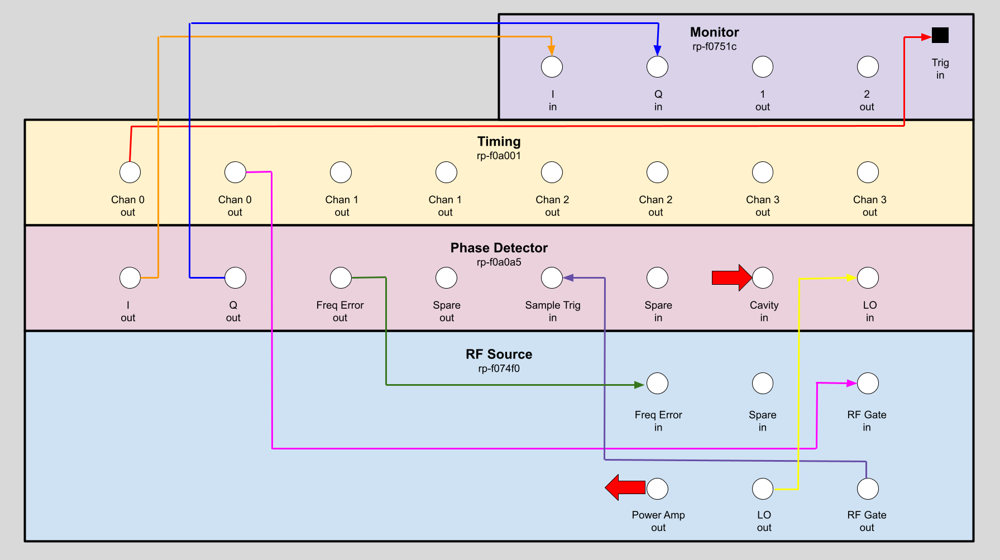
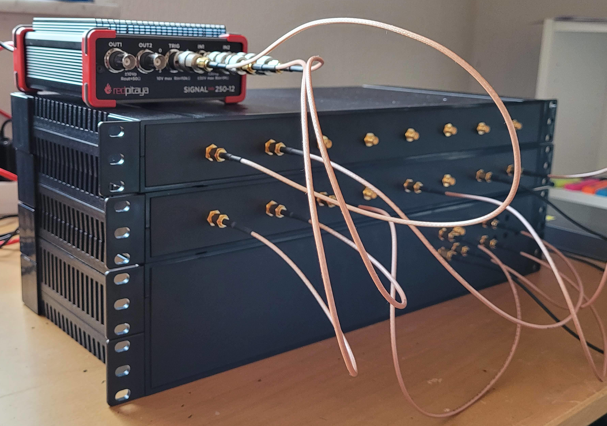
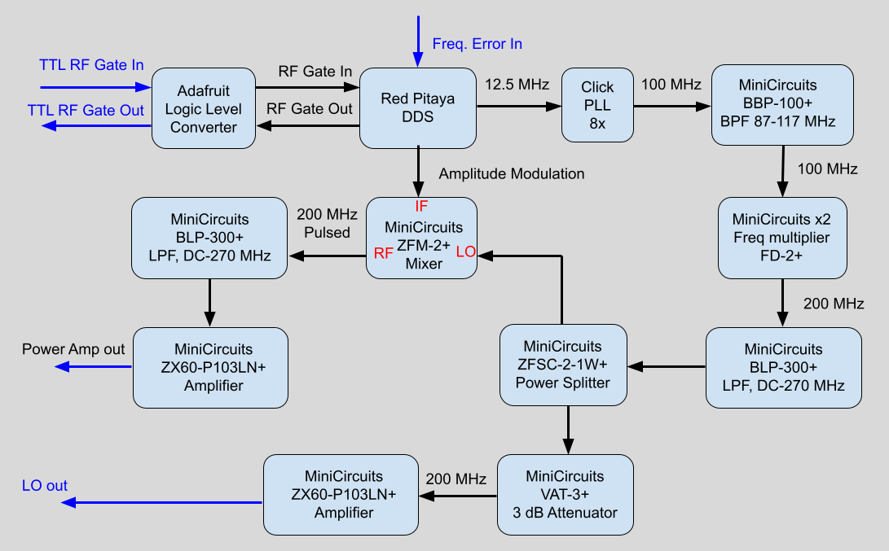
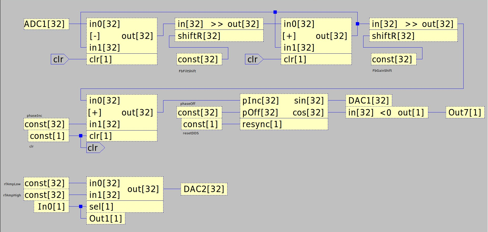
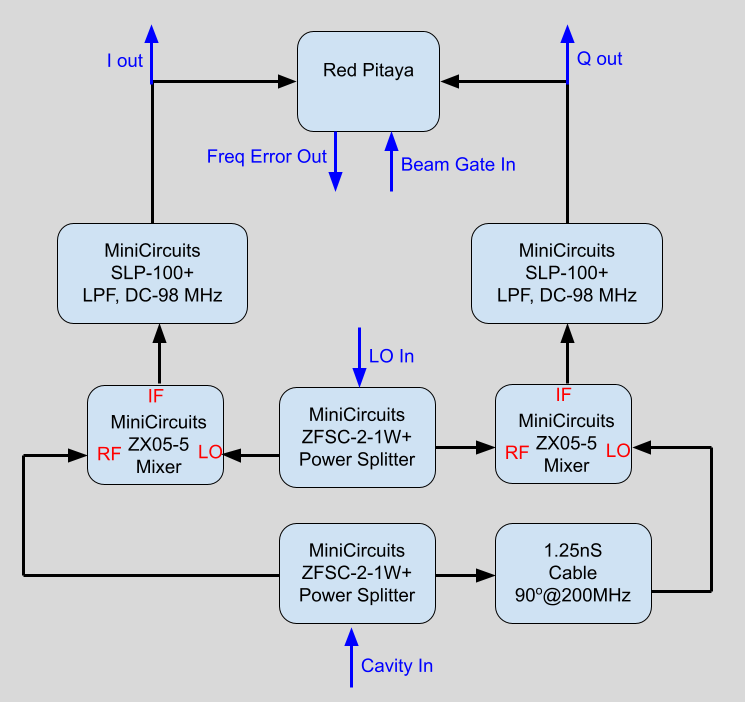
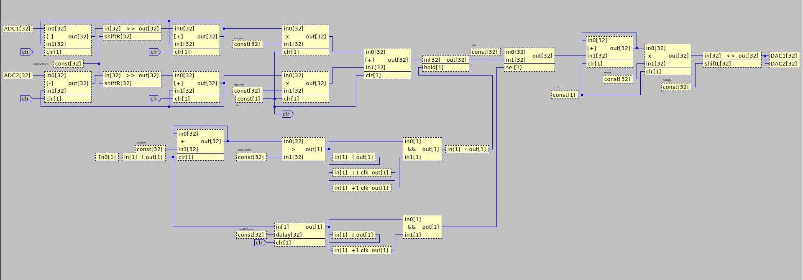

# The Mirrotron LLRF Control System
## Contents
* [Overview](README.md)
* [LLRF Overview](#overview)
    - [Block diagram of LLRF](#figure-1)
    - [LLRF modules Implementation](#figure-2)
* [RF Frequency Source](#rf-frequency-source)
    - [RF Frequency Source Block Diagram](#figure-3)
    - [RF Frequency Source DSP Code](#figure-4)
    - [RF Frequency Source Implementation](#figure-5)
* [Four Quadrant IQ Phase Detector](#four-quadrant-iq-phase-detector)
    - [Phase Detector Block Diagram](#figure-6)
    - [Phase Detector DSP Code](#figure-7)
    - [Phase Detector Implementation](#figure-8)
* [Four Channel Timing System](#four-channel-timing-system)
    - [Timing System DSP Code](#figure-9)
    - [Timing System Implementation](#figure-10)
* [IQ Monitor System](#iq-monitor-system)

## LLRF Overview
[(table of contents)](#contents)
The Low Level RF (LLRF) System is a modular system based on the Red-Pitaya Stemlab 125-14 reconfigurable instrument platform. A modular approach was chosen for design simplicity and future upgrades. Likewise, the Red-Pitaya Stemlab 125-14 was chosen for its ease of use. A block diagram is shown in [Figure 1](#figure-1). The LLRF system comprises of four modules:
- [RF Frequency Source](#rf-frequency-source)
- [Four Quadrant IQ Phase Detector](#four-quadrant-iq-phase-detector)
- [Four Channel Timing System](#four-channel-timing-system)
- [IQ Monitor System](#iq-monitor-system)

##### Figure 1 #####
*Block diagram of LLRF*

##### Figure 2 #####
*LLRF modules Implementation*

## RF Frequency Source
[(table of contents)](#contents)
The function of the RF frequency source is to provide pulsed 200 MHz RF with frequency and amplitude control. In addition it provides a local oscillator signal to the Phase Detector module and in return receives a frequency error signal from the Phase detector. The block diagram of the frequency source is shown in [Figure 3](#figure-3). The RF signal is generated by a Direct Digital Synthesizer (DDS) implemented by the [Red Pitaya Stemlab 125-14](https://redpitaya.com/stemlab-125-14/) FPGA. The FPGA was programmed with the [CANVAS](https://content.redpitaya.com/blog/canvas-a-free-graphical-dsp-design-tool-for-red-pitayas-fpga) tool that is a graphical system for implementing digital signal processing functions into the Stemlab 125-14 FPGA. The CANVAS circuit is shown in [Figure 4](#figure-4).

The clock of the Stemlab 125-14 is 125MHz so a 200 MHz signal cannot be generated directly. Instead a 12.5 MHz signal is generated by the DDS and then this signal is multiplied up to 100 MHz with 8x phase lock loop. The signal is then frequency doubled to 200 MHz. The phase increment on the DDS is set by a 32 bit word so the final frequency resolution is less than 0.5 Hz out of 200MHz. The implementation of the RF Frequency source is shown in [Figure 5](#figure-5).
##### Figure 3 #####
*RF Frequency Source Block Diagram*

##### Figure 4 #####
*RF Frequency Source DSP Code*

##### Figure 5 #####
*RF Frequency Source Implementation*

## Four Quadrant IQ Phase Detector
[(table of contents)](#contents)
Stuff to write
##### Figure 6 #####
*Phase Detector Block Diagram*

##### Figure 7 #####
*Phase Detector DSP Code*

##### Figure 8 #####
*Phase Detector Implementation*

## Four Channel Timing System
[(table of contents)](#contents)
Stuff to write
##### Figure 9 #####
*Timing System DSP Code*

##### Figure 10 #####
*Timing System Implementation*

## IQ Monitor System
[(table of contents)](#contents)
Stuff to write
