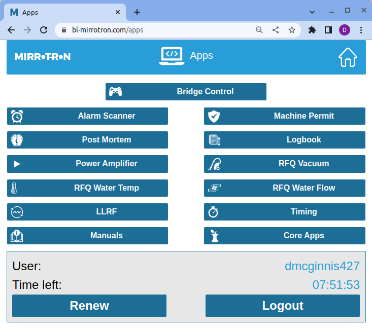
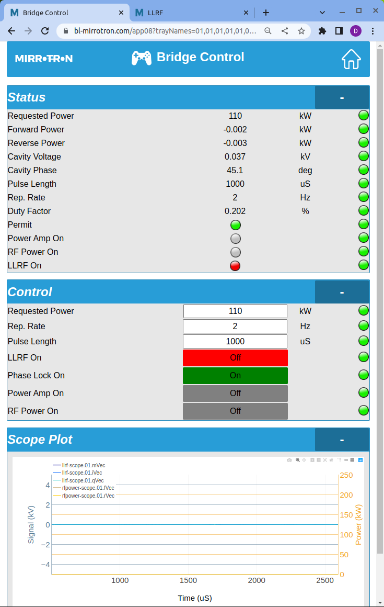

# The Mirrotron RFQ Control System Users' Guide
## Overview
The [control system for the Mirrotron RFQ](https://www.bl-mirrotron.com/) uses the [Blinky-LiteTM](https://www.bl-mc.se/) control platform. This document is an overview of how to use the custom applications for the Mirrotron RFQ. For portability, reliability, and security all Blinky-LiteTM user applications are web apps. The Mirrotron RFQ web apps are located at the app [page](https://www.bl-mirrotron.com/apps).
## System Login
For security, Blinky-LiteTM requires an [https](https://www.cloudflare.com/learning/ssl/what-is-https/) connection. Any attempt at using an http connection will be redirected to an https connection.

You must first obtain a login from your system administrator to access the control system. Blinky-LiteTM uses role-based access with Jason Web Token(JWT) technology for logging into the system. The user is assigned a role to protect the system from the user making inadvertent settings.
### Read-only roles
For read only access, the user must have the following roles:
* reading
* ping
* readDatabase
* renew
* appView
* coreView

### Setting privilege roles
For read only access, the user must have the following roles:
* reading
* setting
* rsetting (for using the RESTful interface)
* ping
* readDatabase
* renew
* appView
* coreView
* writeDatabase

The login JWT has an expiration timer that is set in the user profile by the system administrator. The timer can be extended in the User card found at the bottom of most of the applications as shown in [Figure 1](#figure-1). In addition login JWT expires when the user closes the browser session.
## Web Applications
### Application Index Page
Upon entry to the application [link](https://www.bl-mirrotron.com/apps), the main application index page is displayed as shown in [Figure 1](#figure-1). Most of the applications are for trouble-shooting. The main application for turn-key operations is the Bridge Control app.
### Bridge Control App
Upon startup, the Bridge Control will look as shown in Figure 2. If the RFQ is off but all water systems and vacuum systems are running, there will be a green permit LED in the status card. All alarm LEDs on the right hand page of the status card should be green. Alarm LEDs have the following color scheme.

| Alarm Color |Alarm|
|---|:---:|
|Magenta|below the LOLO limit|
|Blue|below the LOW limit|
|Green|OK|
|Yellow|above the HIGH limit|
|Red|above the HIHI limit|

If any alarm is outside the LOLO or HIHI limit, the machine permit will not be enabled. There will be a discussion later on the steps to be followed if there machine permit is off.

##### Figure 1 #####
*Application Index Page* ([back](*application-index-page)) 

##### Figure 2 #####
*Bridge Control Application at startup* ([back](*bridge-control-app)) 

