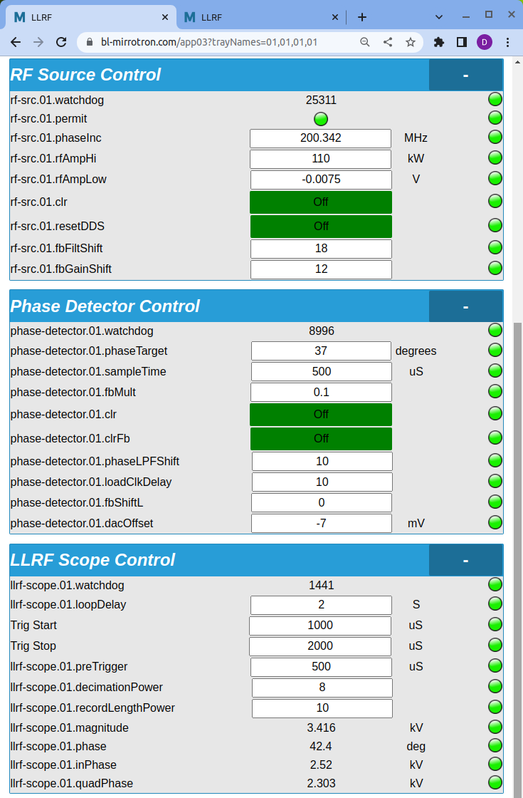

# The Mirrotron RFQ Control System Users' Guide
## Table of Contents
* [Overview](#overview)
* [System Login](#system-login)
  - [Read-only roles](#read-only-roles)
  - [Setting privilege roles](#setting-privilege-roles)
* [Web Applications](#web-applications)
  - [Application Index Page](#application-index-page)
  - [Bridge Control App](#bridge-control-app)
    - [Alarms](#alarms)
    - [RFQ Startup Steps](#rfq-startup-steps)
  * [Machine Permit App](#machine-permit-app)
  * [Alarm Scanner App](#alarm-scanner-app)
  * [Post Mortem App](#post-mortem-app)
  * [Logbook App](#logbook-app)
* [Expert Web Applications](#expert-web-applications)
  * [RF Power Amplifier App](#rf-power-amplifier-app)
  * [RFQ Vacuum App](#rfq-vacuum-app)
  * [RFQ Water Temperature App](#rfq-water-temperature-app)
  * [RFQ Water Flow App](#rfq-water-flow-app)
  * [Low Level RF App](#low-level-rf-app)
    - [RF Frequency Control](#rf-frequency-control)
    - [Phase Lock Control](#phase-lock-control)
    

## Overview
([contents](#table-of-contents)) 
The <a href="https://www.bl-mirrotron.com/" target="_blank">control system for the Mirrotron RFQ</a> uses the <a href="https://www.bl-mc.se/" target="_blank">Blinky-LiteTM</a>  control platform. This document is an overview of how to use the custom applications for the Mirrotron RFQ. For portability, reliability, and security all Blinky-LiteTM user applications are web apps. The Mirrotron RFQ web apps are located at the app <a href="https://www.bl-mirrotron.com/apps" target="_blank">page</a>.

## System Login
([contents](#table-of-contents)) 
For security, Blinky-LiteTM requires an <a href="https://www.cloudflare.com/learning/ssl/what-is-https/" target="_blank">https</a> connection. Any attempt at using an http connection will be redirected to an https connection.

You must first obtain a login from your system administrator to access the control system. Blinky-LiteTM uses role-based access with Jason Web Token(JWT) technology for logging into the system. The user is assigned a role to protect the system from the user making inadvertent settings.

### Read-only roles
([contents](#table-of-contents)) 
For read only access, the user must have the following roles:
* reading
* ping
* readDatabase
* renew
* appView
* coreView

### Setting privilege roles
([contents](#table-of-contents)) 
For read only access, the user must have the following roles:
* reading
* setting
* rsetting (for using the RESTful interface)
* ping
* readDatabase
* renew
* appView
* coreView
* writeDatabase

The login JWT has an expiration timer that is set in the user profile by the system administrator. The timer can be extended in the User card found at the bottom of most of the applications as shown in Figure 1. In addition login JWT expires when the user closes the browser session.

## Web Applications
([contents](#table-of-contents)) 

### <a href="https://www.bl-mirrotron.com/apps" target="_blank">Application Index Page</a>
([contents](#table-of-contents)) 
Upon entry to the web site, the main application index page is displayed as shown in Figure 1. Most of the applications are for trouble-shooting. The main application for turn-key operations is the Bridge Control app.

Figure 1.  Application Index Page

 

### <a href="https://www.bl-mirrotron.com/app08?trayNames=01,01,01,01,01,01,01,01" target="_blank">Bridge Control App</a>
([contents](#table-of-contents)) 
#### Alarms
([contents](#table-of-contents)) 
Upon startup, the Bridge Control will look as shown in Figure 2. If the RFQ is off but all water systems, vacuum systems are running, and power amplifier is running, there will be a green permit LED in the status card. All alarm LEDs on the right hand page of the status card should be green. Alarm LEDs have the following color scheme.

| Alarm Color |Alarm|
|---|:---:|
|Magenta|below the LOLO limit|
|Blue|below the LOW limit|
|Green|OK|
|Yellow|above the HIGH limit|
|Red|above the HIHI limit|

If any alarm is outside the LOLO or HIHI limit, the machine permit will not be enabled. There will be a discussion later on the steps to be followed if there machine permit is off.

Figure 2.  Bridge Control App at startup

 

#### RFQ Startup Steps
([contents](#table-of-contents)) 
* **Turn on LLRF**
  - The LLRF On/Off is the main activator for the machine protection system. If the machine permit has dropped, the LLRF will turn off and stay turned off until the user turns it back on. The next step is to turn on the LLRF in the Control card as shown in Figure 3.

  

Figure 3.  Bridge Control App with LLRF on

  

 

* **Turn on RF power amplifier**
  - With the LLRF on, the RF power amplifier is ready to be turned on. (In fact the RF power amplifier can be turned on before turning on the LLRF). Turn on the power amp button in the Control card as shown in Figure 4.
  - The amplifier will take some time to turn on (~15secs). While the amplifier is turning on, the Power Amp On LED in the Status card will remain gray until the power amplifier is ready and the Power Amp On LED in the Status card will turn green as shown in Figure 5.

  

Figure 4.  Bridge Control App with RF power amp startup

  

 

  

Figure 5.  Bridge Control App with RF power amp ready

  

 

* **Turn on RF power**
  - One the Power Amp On LED in the Status card turns green, press on the RF Power On button on the Control card. Once the RF Power On LED on the Status card turns green, you should see traces appear on Scope Plot Card as shown in Figure 6.
  - The forward and reverse power traces are shown in brown and gold. The forward power should be close (but not exactly) to the requested power shown in the Status and Control cards. The forward and reverse power sampled in the middle of the pulse is shown in the Status card. If the reverse power should be less than 10% of the forward power. If there reverse power is large, there could be an issue with the phase lock which will be discussed later.
  - The cavity voltage normalized to the power coupler are the blue traces. These traces are sampled in the middle of the pulse by the LLRF and report a cavity phase. This phase is used for the phase lock system which keeps the cavity in tune.

  

Figure 6.  Bridge Control App with RF power on

  

 

*  **Adjusting RFQ Parameters**
  - The requested power, repetition rate, and pulse length can be adjusted from the Control card. However, there are limits on how much these parameters can be adjusted. The range of these parameters can be seen by clicking the parameter alarm LED on the right hand side of the app. For example, the alarm range of the repetition rate is shown in Figure 7. If an entry is outside the LOLO-HIHI alarm range , the machine permit will drop.
    - The app will prohibit making setting changes outside the LOLO-HIHI alarm range. However, if the alarm range is changed so that the current setting lies outside the new alarm range, the machine permit will drop.

    

Figure 7.  Repetition Rate Alarm Range

    

 

### <a href="https://www.bl-mirrotron.com/app07?trayNames=01" target="_blank">Machine Permit App</a>
([contents](#table-of-contents)) 
The Bridge Control app gives a quick overview to RFQ operations. However, there are hundreds of parameters in the control system that need to be at the correct value for the RFQ to operate appropriately. If any one of these critical parameters goes outside its LOLO-HIHI alarm range, the permit will drop and the LLRF will be inhibited. For example, Figure 8 shows a machine permit drop when the pulse repetition rate has been set too low. What system pulled the machine permit can be seen on the Machine Permit app as shown in Figure 9 in which it is clear that the timing system pulled the permit.

Figure 8.  Machine Permit Abort

 

Figure 9.  Machine Permit App

 

### <a href="https://www.bl-mirrotron.com/alarmScanner" target="_blank">Alarm Scanner App</a>
([contents](#table-of-contents)) 
The specific parameters that are in alarm and the type of alarm can be detailed in the Alarm Scanner App. The alarms are grouped into *Alarms* which are parameters that are outside the LOLO-HIHI limits and *Warnings* which are parameters outside the LOW-HIGH limits. Alarms will pull the Machine permit, warnings will not. For the example in which the pulse repetition rate has been set too low, a view of the alarms are shown in Figure 10.

Figure 10.  Alarm Scanner App

 

### <a href="https://www.bl-mirrotron.com/postMortem" target="_blank">Post Mortem App</a>
([contents](#table-of-contents)) 
As discussed in the Machine Permit app [section](#machine-permit-app) When the Machine permit is pulled the LLRF will be inhibited. The LLRF will stay inhibited until it is turned back on again, even if the critical parameter goes back inside its LOLO-HIHI alarm range. This often happens during a vacuum pressure spikeLogBookIndex. For example, Figure 11 shows the machine permit being cleared when the pulse repetition rate has been set inside allowed range. The machine permit is clear but the LLRF is still off. So now the user does not know why the Machine permit was pulled.

To find out which parameter caused a machine permit abort, the Blinky-LiteTM control platform provides a Post-Mortem application as shown in Figure 12. When the Machine permit transitions from good to bad (an abort), the control system sends out a broadcast to all the sub-systems (Blinky-LiteTM trays) to save their current state in timestamped archive database. The Machine Permit app shows a list of all the machine permit aborts. The user can then select one of the Machine permit abort events to see what parameters pulled the Machine permit as shown in Figure 13 in which the machine permit abort was caused by setting the repetition rate too low.
LogBookIndex

Figure 11.  Bridge Control App with the machine permit cleared

 

Figure 12.  Post Mortem app

 

Figure 13.  Post Mortem app with alarm list

 

### <a href="https://www.bl-mirrotron.com/logbook" target="_blank">Logbook App</a>
([contents](#table-of-contents)) 
For reliable operations its is very important to keep a logbook of the status of the control system and accelerator. Instead of a 3rd party add-on, the Blinky-LiteTM control platform provides a Logbook application fully integrated into the control system as shown in Figure 14. The Logbook app is text-only on purpose to keep the log entries as clear and concise as possible. The Logbook app is not intended as a notebook. There are a myriad of 3rd party apps that serve that purpose.

Figure 14.  Logbook App

 

To display an entry select the blue Display button next to the right of the entry of interest. The entry display box appears along with the date, author, and title of the entry as shown in Figure 15. The entry display box can be resized to fit the entry text.

Figure 15.  Logbook App Entry Display

 

To add an entry, you will need to have writeDatabase privileges defined in your [roles](#setting-privilege-roles). Click the dark blue Add button on the upper right hand of the Entries card and a dialog box will appear in which you can add the title and text of the entry as shown in Figure 16. The date and author based on your [system Login](#system-login) will be added automatically.

Figure 16.  Logbook App adding an entry

 

Often, an entry needs corrections so the Logbook has basic editing features which can be accessed by pressing the yellow button next to the right of the entry of interest as shown in Figure 17. An entry can also be deleted  with the red button next to the yellow edit button. To provide for accountability, only the author of the entry can edit or delete the entry. The right-hand panel of Figure 17 shows that error message will be generated if somebody other than the author tries to edit an entry.

Figure 17.  Logbook App editing an entry

 

## Expert Web Applications
([contents](#table-of-contents)) 
Almost all operational issues should be handled with the [Bridge Control App](#bridge-control-app). However for optimum performance, the parameters of individual sub-systems (Blinky-LiteTM trays) will need to be adjusted or viewed.

### <a href="https://www.bl-mirrotron.com/app09?trayNames=01,01,01" target="_blank">RF Power Amplifier App</a>
([contents](#table-of-contents)) 
The RFQ accelerator is powered with a 300kW solid state amplifier operating at 200 MHz. Basic operation of this amplifier can be done with the [Bridge Control App](#bridge-control-app). However, along with basic operation, the alarm, warning, and watchdog status can be monitored with the RF Power Amp app as shown in Figure 18. The peak RF power sampled at the middle of the pulse is shown in the Status card. This read-back is based on a headless oscilloscope monitor in the diode detected output from the front panel of the the power amplifier which also provides the traces in the Scope Plot card. The RF power is also reported in the Amplifier Status card which is derived from the amplifier manufacturer. Since these are both diode detected devices, there will be some discrepancy in the readings due to calibration.

* <ins>The error and warning code descriptions</ins> can be found in the manufacturer manual.
  - An online version of the codes will be added in the future.
  - If the amplifier trips due to an error such as reflected power, the amplifier error be reset in the Amplifier Control card.
* <ins>The power-on sequence</ins> should be followed just as outlined in [RFQ Startup Steps](#rfq-startup-steps) described in the [Bridge Control App](#bridge-control-app).
* <ins>The settings of the headless oscilloscope monitor</ins>, such as the triggering and record length can be adjusted in the RF Power Scope Control card but these settings should be rarely, if ever, adjusted.

Figure 18.  RF Power Amp app

 

### <a href="https://www.bl-mirrotron.com/app04?trayNames=01,01,02" target="_blank">RFQ Vacuum App</a>
([contents](#table-of-contents)) 

The RFQ vacuum system consists of two turbo pumps mounted directly on the RFQ. The turbo pumps can be isolated from the RFQ via fast gate valves mounted between the turbo pumps and the RFQ body. The exhaust of the turbos is handled by dry scroll backing pumps, one for each turbo pump. The gate valves and the backing pumps can be complete operated remotely via the control system. However, the turbo pumps require manual startup and shutdown as detailed in the <a href="https://www.bl-mirrotron.com/app05?trayNames=none" target="_blank">online-vacuum manuals</a>.

Figure 19 shows the Vacuum status and Control cards for the vacuum system. The vacuum pressure units are in logPa
* -5 logPa = 1x10-5 Pa
* -5 logPa = 1x10-7 mbar
* -5 logPa = 7.5x10-8 Torr

Figure 20 shows the Time Plot and Archive Plot cards for viewing the vacuum pressure evolution and history inside the RFQ (gauges 3 & 4) and in the exhaust lines (gauges 1 & 2). Figure 21 shows the  Backing Pumps control cards and the Turbo Pumps status card.

Figure 19.  RFQ Vacuum app status and control

 

Figure 20.  RFQ Vacuum pressure time and archive plots

 

Figure 21.  RFQ Vacuum scroll pump control and turbo pump status

 

### <a href="https://www.bl-mirrotron.com/app01?trayNames=inlet,outlet" target="_blank">RFQ Water Temperature App</a>
([contents](#table-of-contents)) 

The RFQ has two water cooling headers, one upstream of proton acceleration (inlet) and one downstream (outlet). Operation of the Chilling units is detailed in the <a href="https://www.bl-mirrotron.com/app05?trayNames=none" target="_blank">online-vacuum manuals</a>.

The temperature of the water cooling channels is presented in the RFQ Temperature App as shown in Figure 22. As with all Blinky-LiteTM applications, the alarm limits can also be edited by clicking on the appropriate alarm LED on the right hand side of the card as shown in Figure 23. As stated earlier, a reading outside the LOLO-HIHI limits will pull the Machine permit.

Figure 22.  RFQ Temperature App

 

Figure 23.  RFQ Temperature alarm edit

 

### <a href="https://www.bl-mirrotron.com/app02?trayNames=inlet,outlet" target="_blank">RFQ Water Flow App</a>
([contents](#table-of-contents)) 

As described above, the RFQ has two water cooling headers, one upstream of proton acceleration (inlet) and one downstream (outlet). Operation of the Chilling units is detailed in the <a href="https://www.bl-mirrotron.com/app05?trayNames=none" target="_blank">online-vacuum manuals</a>.

The water flow of the water cooling channels is presented in the RFQ Water Flow App as shown in Figure 24. As stated earlier, a reading outside the LOLO-HIHI limits will pull the Machine permit.

Figure 24.  RFQ Water Flow app

 

### <a href="https://www.bl-mirrotron.com/app03?trayNames=01,01,01,01" target="_blank">Low Level RF App</a>
([contents](#table-of-contents)) 

The Low Level RF (LLRF) controls the amplitude and frequency of the RF signal that is fed into the RF power amplifier. The system consists of three Blinky-LiteTM trays.
* RF Source
* Phase Detector
* LLRF Scope

Each of these trays has quite a few parameters that are <a href="https://bl-mirrotron.github.io/#rf-source" target="_blank">described</a> in the system architecture. The LLRF app is shown in Figure 25. The Status card displays the cavity voltage detected by the cavity pickup and normalized to the coupler voltage measured at the center of the RF pulse. The phase signal is the comparison between the RF wave sent to the Power amplifier to the RF wave detected at the cavity pickup. The absolute value of the phase signal is arbitrary and is affected by cable lengths in the system in addition to the cavity transfer function. Relative changes of the phase can be used to determine if the cavity resonant frequency is drifting.

Below the status card is the LLRF scope plot which shows the magnitude, in-phase and out-of-phase components of the cavity voltage. The LLRF scope plot can be adjusted in the LLRF Scope Control Card shown in Figure 26 but most of these parameters should be rarely adjusted.

#### RF Frequency Control
The RF frequency and amplitude is set by the parameters in the RF Source Control card.
* <ins>rf-src-01.phaseInc</ins> sets the RF frequency without phase feedback.
* <ins>rf-src-01.rfAmpHi</ins> sets the amplitude of the RF pulse in units of kW.
  - It is the same value as the Requested Power displayed in Control card of the [Bridge Control app](#bridge-control-app).
* <ins>rf-src-01.rfAmpLowi</ins> sets offset value in the RF Gate
  - add is used to minimize leakage voltage in the RF gate.
* <ins>rf-src-01.clr</ins> turns off all components of the RF frequency source FPGA
* <ins>rf-src-01.resetDDS</ins> turns off Direct Digital Synthesizer of the RF frequency source FPGA
  - it is the parameter used by the Machine Permit system to stop RF power supplied to the RFQ.
  - it is also the logical inverse of <ins>LLRF On</ins> shown in the Control card of the [Bridge Control app](#bridge-control-app)
* <ins>rf-src-01.fbFiltShift</ins> controls low past filter that filters noise coming from the Phase Detector error signal that is used to correct the RF frequency when the system is in phase lock mode.
  - A value of 1 is a filter with a corner at 62.5 MHz.
  - A value of 2 is a filter with a corner at 31.2 MHz
  - A value of 18 is a filter with a corner at 477 Hz
* <ins>rf-src-01.fbGainShift</ins> reduces the Phase Detector error signal that is used to correct the RF frequency when the system is in phase lock mode.
  - A value of 1 reduces the signal by 2
  - A value of 2 reduces the signal by 4
  - A value of 12 reduces the signal by 4096

#### Phase Lock Control

Figure 25.  LLRF app

 

Figure 26.  LLRF Control cards

 
